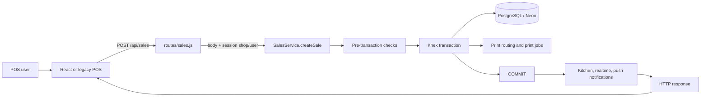
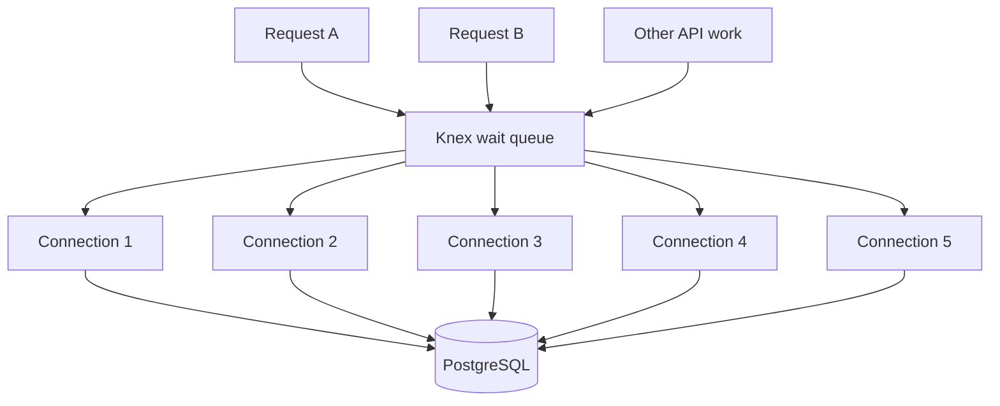
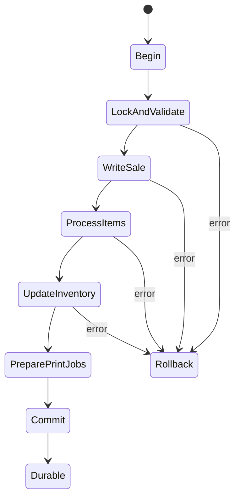
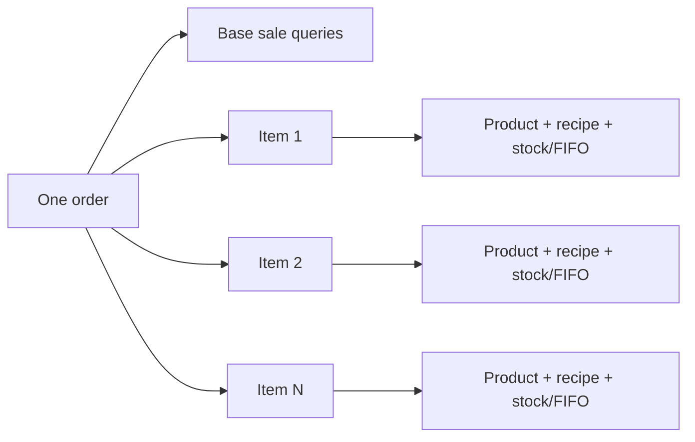
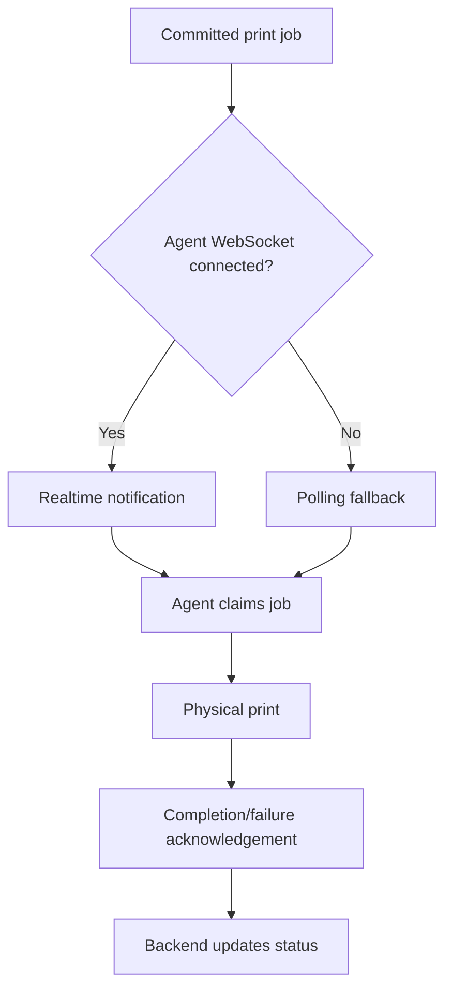
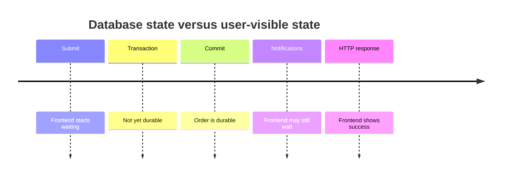
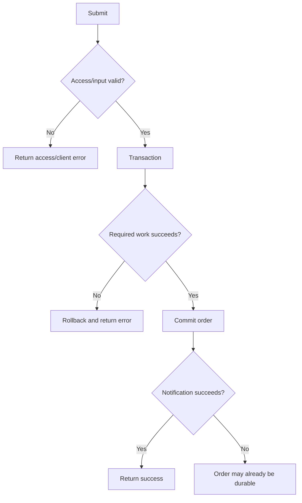
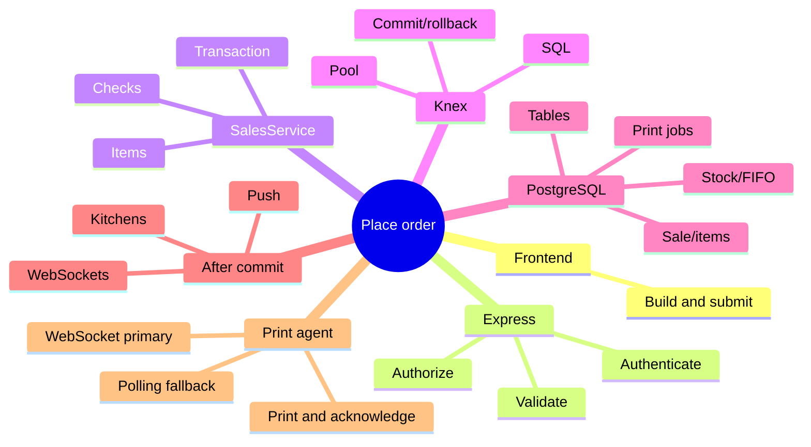

# Order Placement Flow: Frontend to Database and Printing

This is the verified DevForge RMS flow. It is documentation only and changes no application behavior.

## Complete system view



An order is not one `INSERT`. It includes access checks, preliminary reads, transactional writes, per-item stock work, print-job creation, commit, and post-commit notifications.

## Implementation map

| Layer | Main code | Purpose |
|---|---|---|
| Frontend | `frontend/src/modules/pos/PosPage.jsx`, `public/js/app.js` | Build payload, submit, show result |
| API | `routes/sales.js` | Receive request with authenticated shop/user |
| Business logic | `services/SalesService.js:createSale()` | Validate and coordinate creation |
| SQL/pool | `db/knex.js` | Build SQL, pool connections, transact |
| Database | PostgreSQL on Neon | Persist sales, items, stock, tables, print jobs |
| Realtime | `notifyNewOrder()` and realtime services | Notify kitchens and clients |
| Printing | Print routing/jobs and agent API | Deliver, claim, print, acknowledge |

Knex is a SQL query builder and pool/transaction manager here, not a full ORM. Application code explicitly decides which queries run and in what order.

## Exact request sequence

```mermaid
sequenceDiagram
  autonumber
  actor User
  participant FE as POS frontend
  participant API as Express sales route
  participant SS as SalesService.createSale
  participant K as Knex pool
  participant DB as PostgreSQL / Neon
  participant PR as Print routing
  participant RT as Realtime and push
  User->>FE: Click Kitchen / Save Order
  FE->>FE: Validate cart and build payload
  FE->>API: POST /api/sales
  API->>API: Session, permission, shop, input checks
  API->>SS: createSale(body, session.shop_id, session.user.id)
  SS->>DB: Order type, shop, user/waiter, duplicate, table checks
  SS->>K: Begin transaction
  K->>DB: Acquire connection and BEGIN
  SS->>DB: Lock/read shop; choose order number; check shift/table
  loop Each order item
    SS->>DB: Product/variant/recipe/ingredient reads
    SS->>DB: Stock/FIFO reads and writes; item writes
  end
  SS->>DB: Sale, tips, table occupancy, related writes
  SS->>PR: Resolve routes and create print jobs
  PR->>DB: Store jobs
  SS->>K: COMMIT
  SS->>DB: getRoutedKitchenIdsForSale()
  SS->>RT: await notifyNewOrder()
  SS-->>API: Created sale
  API-->>FE: HTTP success
```

The route calls:

```js
salesService.createSale(req.body, req.session.user.shop_id, req.session.user.id)
```

The shop/user context comes from the authenticated session rather than trusting browser-supplied identity.

## Knex pool versus users



The verified defaults are `min: 0`, `max: 5`. Ten users do not create ten permanent connections; their requests share the pool. More than five concurrent database workloads wait. Minimum zero lets idle connections close, so a request after inactivity may pay connection setup and Neon wake-up.

```text
possible maximum connections = application instances x pool maximum
```

## Transaction and rollback



One transaction reserves one pooled connection. It covers order numbering, shift/table checks, sale/items, recipes/ingredients, stock/FIFO, tips, occupancy, and print-job records. Errors before commit roll back the unit and prevent partial orders.

## Query multiplication



Product, recipe, ingredient, and inventory work may repeat for every item/component. A larger order can be slower even if no individual SQL statement is exceptionally expensive.

## Print delivery after job creation



WebSocket and polling deliver the same durable jobs. The order request does not wait for physical printing, but routing and print-job creation happen during order creation.

## Why success can appear late

After commit, `createSale()` calls `getRoutedKitchenIdsForSale()` and awaits `notifyNewOrder()`. This includes more database/realtime/push work. Therefore, the database order may already be committed while the frontend still displays Processing.



## Latency formula

```text
visible time ~= connection acquisition/wake-up
             + sequential DB round trips
             + transaction/application work
             + per-item inventory work
             + print routing/job creation
             + awaited realtime/push work
             + HTTP/frontend rendering
```

| Area | How delay occurs |
|---|---|
| Cold database/connection | Neon idle state plus pool minimum zero |
| Region distance | Every query pays app-to-database network latency |
| Sequential queries | Round-trip times add together |
| Per-item loops | Work repeats for products/recipes/ingredients |
| Pool contention | Excess concurrent work waits |
| Locks | Orders compete for shop, table, stock, numbering rows |
| Indexes | Weak/missing indexes cause excess scanning |
| Joins/groups | Large intermediate results use more DB resources |
| Awaited push | Commit finishes before UI receives success |

## Confirmed measurements

- Neon PostgreSQL is in AWS `us-east-2`.
- First connection/simple query measured about **2.7 seconds**.
- Twenty sequential trivial queries on one reused connection took about **5.4 seconds**.
- Average reused-connection round trip was about **245 ms**.
- Ten simultaneous simple queries with pool max five completed in waves, as expected.
- `createSale()` contains many operations and per-item work.
- Routing/notification work runs after the transaction but before the response.

Illustration only, not an exact query count:

| Component | Example |
|---|---:|
| Cold connection/wake-up | 2.7 s |
| 20 sequential round trips x 245 ms | 4.9 s |
| Extra item, stock, print work | 2-5 s |
| Notifications/HTTP | 0.5-2 s |
| Possible total | 10.1-14.6 s |

This explains a 10-15 second experience without proving that Knex itself is defective.

## What is not yet proven

The evidence does **not** prove every query has the ideal index, every join/group is optimal, caching is optimal, lock contention never occurs, or one query causes most delay. Those claims need request tracing, slow-query evidence, representative data, and PostgreSQL `EXPLAIN (ANALYZE, BUFFERS)`. Functional tests prove behavior, not optimal speed.

## Failure boundary



A post-commit failure cannot uncommit the sale. Monitoring should distinguish “transaction failed” from “order committed but notification failed.”

## Safe investigation checklist

1. Submit-to-response duration.
2. Middleware/controller time.
3. Pool acquisition time.
4. Transaction time.
5. Sanitized query count and per-query time.
6. Per-item and FIFO time.
7. Print-routing/job time.
8. Post-commit realtime/push time.
9. Application region versus Neon region.
10. Plans for the slowest queries.
11. Pool saturation, lock waits, cold starts.
12. Response time grouped by item count.

## Final model



The central conclusion: order placement is a multi-stage transactional workflow. Visible time depends on database distance/wake-up, sequential query count, order size, pool availability, locks/query plans, and notification work awaited after commit.
